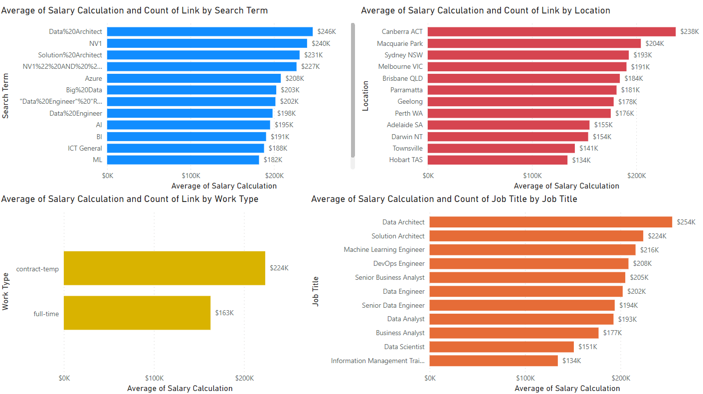
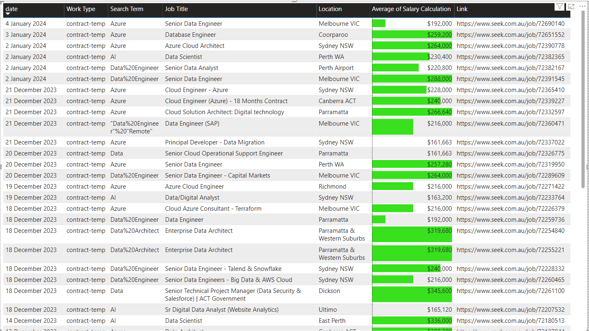
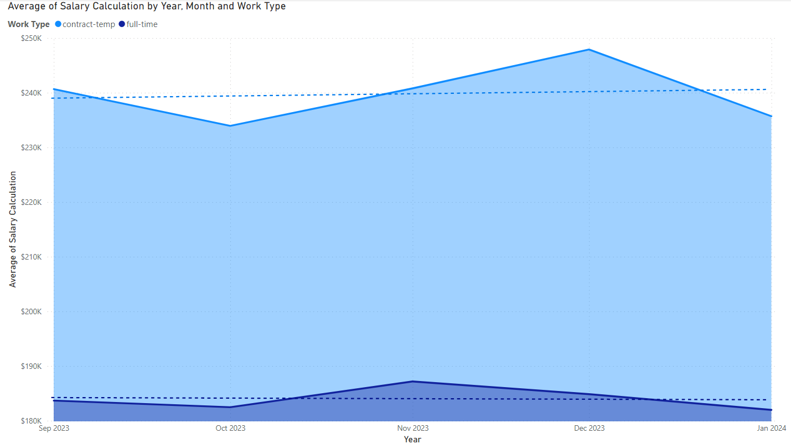

# Job Scraper

This project is for scraping job adverts from www.seek.com.au.

Unique jobs are appended to the jobs excel file each time you run it with the current date that it was found. Uniqueness was based on the URL of the job ad.

A few other fields are saved and salaries are normalised to Per Annum.

The program will check any of the ads to see if they are still active when running the .bat file and mark what date they were removed. This allows you to see how long they are listed and view currently active jobs. Might not work atm if you haven't already got data. I haven't tested that.

The Analytics.pbix is a PowerBI file that allows you to view a ton of information about the data you have scraped. I use this every day to look at jobs.

Data is stored in both Excel and Postgres if you have a server configured.

## Setup

Clone https://github.com/MichaelJenningsAI/jobscraper.git

Open a terminal in the new folder.

Run `python -m venv venv` to create a new python virtual environment.

Create a new terminal and you should see (venv) before your folder location.

Run `pip install -r requirements.txt` to install all the required python packages to your new environment.

Update your search terms in `config.py` to match what jobs you want to search for. `%20` is required whereever a space would be.

### Postgres

If you want you can use your own postgres server to load the data.

Run the schema.sql in your database.

Remove the `-removethis` from `credentials-removethis.py` and then update it with your postgres details.

## How to Run

1. Make sure you have changed your settings and built your environment correctly.
2. Ensure you have selected the search terms you want in `config.py`!
3. Double click `jobscraper.bat` and it will start scraping! Alternatively run `python jobscraper.py`

This should trigger a browser window to open and start cycling through all the job pages for the search terms you have in config.py.

Try not to run this too often as you will get blacklisted or they will change their website so this doesn't work!

I run it once a day.

### Windows Task Scheduler

1. In start search for `Task Scheduler`.
2. Go to `Task Scheduler Library`
3. `Create Task...`
4. Go to Actions and New...
5. Choose the Program Script like: `D:\jobscraper\jobscraper.bat` obviously adjust to your location.
6. Start in: `D:\jobscraper\`
7. Save and go to Triggers, New...
8. Choose a schedule and save all and close.
9. Test the task by right clicking and pressing Run

## Backlog

* Extract details from each job advert.

  * Contact Names
  * Contact Numbers
  * Skills lists
* Auto Apply for 'Quick Apply' jobs.
* Generate JSON resume based on advert.
* Gererate Cover letters based on advert.
* Use Machine Learning to Guestimate Salary / Scrape payscales
* Additional job websites (MAANG+)
* Fix Fortnightly Salaries
